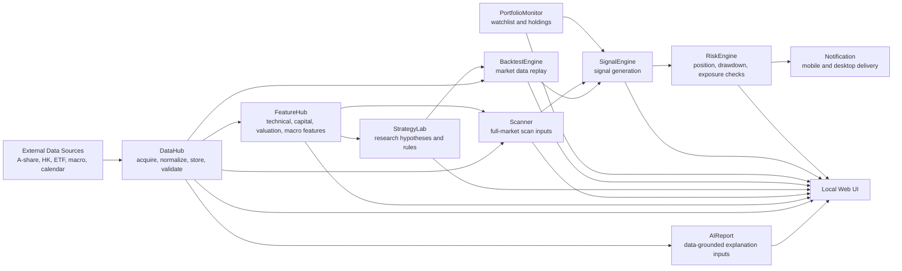

# System Architecture

## System Map

## Module Responsibilities

### DataHub

DataHub is the system data foundation.

Responsibilities:

- collect comprehensive source data for A-share, Hong Kong stock, ETF/fund, index, concise global equity, sector, macroeconomic, policy, news, and announcement domains
- normalize symbols, calendars, time zones, and schemas
- persist data locally
- validate data quality
- expose stable datasets to downstream modules
- separate default offline tests from optional live source tests

### FeatureHub

FeatureHub derives research-ready features from DataHub outputs.

Future responsibilities:

- technical indicators
- capital-flow features
- valuation features
- macro features
- feature versioning
- feature metadata

FeatureHub must not fetch market data directly when DataHub can provide it.

### StrategyLab

StrategyLab is the research workspace for strategy ideas.

Future responsibilities:

- strategy definitions
- parameter experiments
- signal prototypes
- research notebooks or scripts
- experiment tracking

StrategyLab must depend on DataHub and FeatureHub contracts.

### BacktestEngine

BacktestEngine evaluates strategy behavior on historical data.

Future responsibilities:

- event or bar replay
- execution assumptions
- cost and slippage models
- portfolio accounting
- performance metrics

BacktestEngine must not own data acquisition.

### Scanner

Scanner performs broad-market screening.

Future responsibilities:

- universe selection
- rule-based scans
- factor and feature filters
- candidate ranking
- daily scan artifacts

Scanner must use DataHub and FeatureHub outputs rather than live ad hoc requests.

### PortfolioMonitor

PortfolioMonitor tracks watchlists and holdings.

Future responsibilities:

- watchlist state
- portfolio positions
- exposure summaries
- holding-level health checks
- links between holdings and signals

No automated trading is allowed unless a future explicit phase opens it.

### SignalEngine

SignalEngine combines scanner, strategy, and portfolio context into actionable signals.

Future responsibilities:

- signal generation
- signal state management
- signal deduplication
- signal severity
- handoff to risk checks

### RiskEngine

RiskEngine gates signals through user-defined risk policy.

Future responsibilities:

- exposure limits
- drawdown rules
- liquidity checks
- concentration checks
- position sizing guidance

RiskEngine is advisory unless a future phase explicitly authorizes automation.

### Notification

Notification delivers approved alerts.

Future responsibilities:

- mobile push
- email or chat delivery
- alert throttling
- delivery audit logs

Notification must not create signals by itself.

### AIReport

AIReport explains data, features, scans, and signals in natural language.

Future responsibilities:

- data-grounded explanations
- daily summaries
- signal narratives
- risk notes
- source-linked output

AIReport must consume structured outputs. It must not become a hidden data pipeline.

### Local Web UI

The local Web UI presents the system for personal use.

Future responsibilities:

- DataHub status
- market data browser
- scan results
- strategy research views
- portfolio monitor
- signal and risk dashboards
- report viewer

The UI should remain local-first unless a future decision changes deployment assumptions.

## Dependency Direction

Preferred dependency flow:

`DataHub -> FeatureHub -> Scanner / StrategyLab -> BacktestEngine -> SignalEngine -> RiskEngine -> Notification / UI`

Cross-cutting modules such as AIReport and UI may read outputs from multiple modules, but must not own core business logic.
